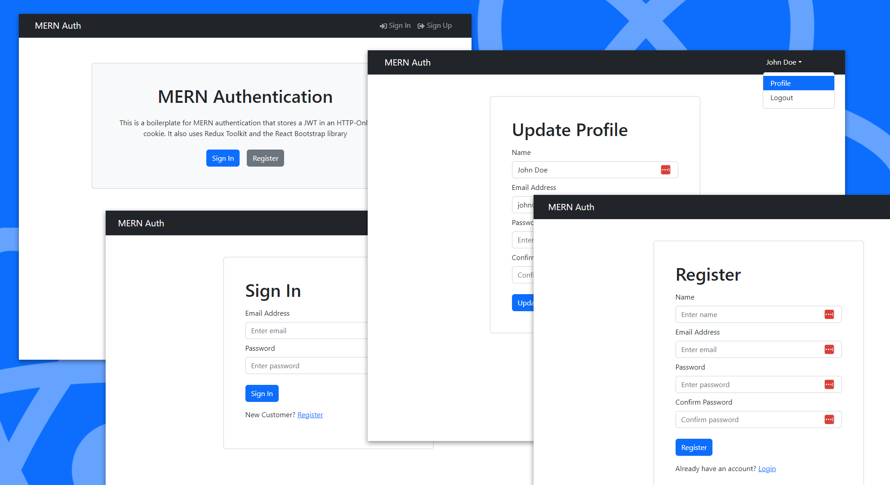

# MERN Authentication Starter

This is a starter app for a MERN stack application with authentication. This is for a SPA (Single Page Application) workflow that uses the [Vite](https://vite.dev) Build tool. This authentication workflow is based off of my [MERN Stack From Scratch | eCommerce](https://www.traversymedia.com/mern-stack-from-scratch) course.



It includes the following:

- Backend API with Express & MongoDB
- Routes for auth, logout, register, profile, update profile
- JWT authentication stored in HTTP-only cookie
- Protected routes and endpoints
- Custom middleware to check JSON web token and store in cookie
- Custom error middleware
- React frontend to register, login, logout, view profile, and update profile
- React Bootstrap UI library
- React Toastify notifications

## Usage

- Create a MongoDB database and obtain your `MongoDB URI` - [MongoDB Atlas](https://www.mongodb.com/cloud/atlas/register)
- Create a PayPal account and obtain your `Client ID` - [PayPal Developer](https://developer.paypal.com/)

### Env Variables

Rename the `.env.example` file to `.env` and add the following

```
NODE_ENV = development
PORT = 5000
MONGO_URI = your mongodb uri
JWT_SECRET = 'abc123'
```

Change the JWT_SECRET to what you want

### Install Dependencies (frontend & backend)

```
npm install
cd frontend
npm install
```

### Run

```

# Run frontend (:3000) & backend (:5000)
npm run dev

# Run backend only
npm run server
```

## Build & Deploy

```
# Create frontend prod build
cd frontend
npm run build
```

<br><hr>

## 🚀 FYP Collection | Open Source & Professional
**Repository #17 of 37**

This project is proudly part of my curated **Final Year Projects (FYP) Collection**. I have organized and open-sourced this collection to showcase professional-grade development, modern architectural implementations, and scalable solutions.

🔗 **Repository Link:** [https://github.com/useratnns/fyp-mern-auth](https://github.com/useratnns/fyp-mern-auth)

---

### 👨‍💻 Developed By


### 🌐 Let's Connect (Contact Information)

Whether you need to integrate these links directly into your UI components or just want to connect, here are my official contacts:

``javascript
[
  { link: 'https://linkedin.com/in/musman100official', icon: '<i class="fab fa-linkedin-in"></i>' },
  { link: 'https://github.com/useratnns', icon: '<i class="devicon-github-original colored" style="filter: invert(1);"></i>' },
  { link: 'mailto:usmanboota.dev@gmail.com', icon: '<i class="fas fa-envelope"></i>' },
  { link: 'https://facebook.com/share/1E9deijpxL/', icon: '<i class="fab fa-facebook-f" style="color: #1877f2;"></i>' },
  { link: 'http://www.corecslab.com', icon: '<i class="fas fa-globe"></i>' },
  { link: 'https://instagram.com/callme_usman._', icon: '<i class="fab fa-instagram" style="color: #ec4899;"></i>' },
  { link: 'https://wa.me/923000437358', icon: '<i class="fab fa-whatsapp" style="color: #22c55e;"></i>' }
]
``
